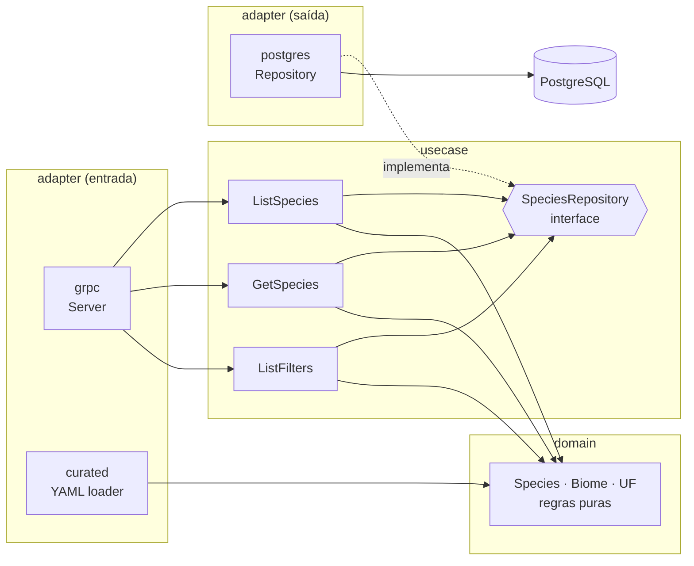

# passarim-catalog

Catalog API do **Passarim**: guarda as aves do Brasil no PostgreSQL e as serve via **gRPC** para o BFF.
Todo o código é comentado para estudo. Arquitetura geral: [passarim-docs](https://github.com/velosobr/passarim-docs).

## Arquitetura limpa

As setas só apontam **para dentro**: `domain` não conhece banco nem gRPC.

## Rodando
| Comando | O que faz |
|---|---|
| `make test` | Testes (os de integração sobem um PostgreSQL via Docker) |
| `make generate` | Gera o código das queries (sqlc) |
| `make lint` | golangci-lint |
| `make run` | Sobe a API apontando para o PostgreSQL do compose |

Tudo junto (banco + API + seed): veja o `docker compose` do [passarim-docs](https://github.com/velosobr/passarim-docs).

## Conteúdo
As 40 aves curadas ficam em [`content/species`](content/species) — veja as [regras de escrita](content/README.md).
