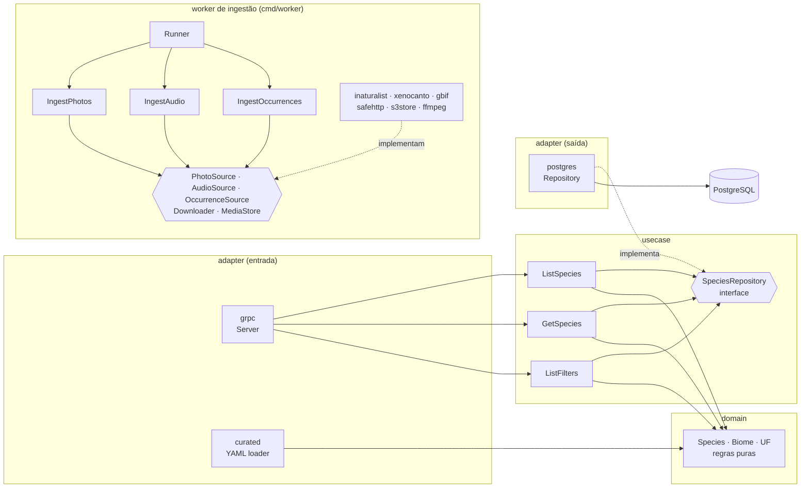

# passarim-catalog

Catalog API do **Passarim**: guarda as aves do Brasil no PostgreSQL e as serve via **gRPC** para o BFF.
Todo o código é comentado para estudo. Arquitetura geral: [passarim-docs](https://github.com/velosobr/passarim-docs).

## Arquitetura limpa

As setas só apontam **para dentro**: `domain` não conhece banco nem gRPC.

## Worker de ingestão

O `cmd/worker` busca, para cada ave, **fotos** (iNaturalist), o **canto** (xeno-canto) e os **avistamentos** (GBIF), converte a mídia (WebP e AAC com ffmpeg), guarda no object storage e grava chaves e créditos no PostgreSQL.

- **Fila no PostgreSQL:** a tabela `ingestion_job` tem um job por (espécie, fonte). Vários workers podem rodar juntos: `FOR UPDATE SKIP LOCKED` garante que não peguem o mesmo job.
- **Retry com backoff:** cada falha dobra a espera (1 min × 2^tentativa, teto de 6 h), até 5 tentativas. Uma fonte com defeito não bloqueia as outras.
- **Licenças:** só CC0, CC-BY, CC-BY-SA, CC-BY-NC e CC-BY-NC-SA (NC pode ser desligado com `ALLOW_NC=false`). ND é sempre recusada, **antes** de baixar o arquivo ([ADR-0007](https://github.com/velosobr/passarim-docs/blob/main/docs/adr/0007-licencas-aceitas.md)).
- **Anti-SSRF:** downloads só por HTTPS, de hosts de uma allowlist, com checagem do IP na hora da conexão (vale também para redirecionamentos) e limites de tamanho e tipo.
- **Imagem própria:** Alpine + ffmpeg, sem root ([ADR-0014](https://github.com/velosobr/passarim-docs/blob/main/docs/adr/0014-imagem-do-worker-com-ffmpeg.md)). Storage: SeaweedFS local / R2 em produção ([ADR-0006](https://github.com/velosobr/passarim-docs/blob/main/docs/adr/0006-midia-em-object-storage.md)).

## Rodando
| Comando | O que faz |
|---|---|
| `make test` | Testes (os de integração sobem PostgreSQL e SeaweedFS via Docker; os de mídia precisam de `ffmpeg` com libwebp) |
| `make generate` | Gera o código das queries (sqlc) |
| `make lint` | golangci-lint |
| `make run` | Sobe a API apontando para o PostgreSQL do compose |

Tudo junto (banco + API + seed): veja o `docker compose` do [passarim-docs](https://github.com/velosobr/passarim-docs).

## Conteúdo
As 40 aves curadas ficam em [`content/species`](content/species) — veja as [regras de escrita](content/README.md).
